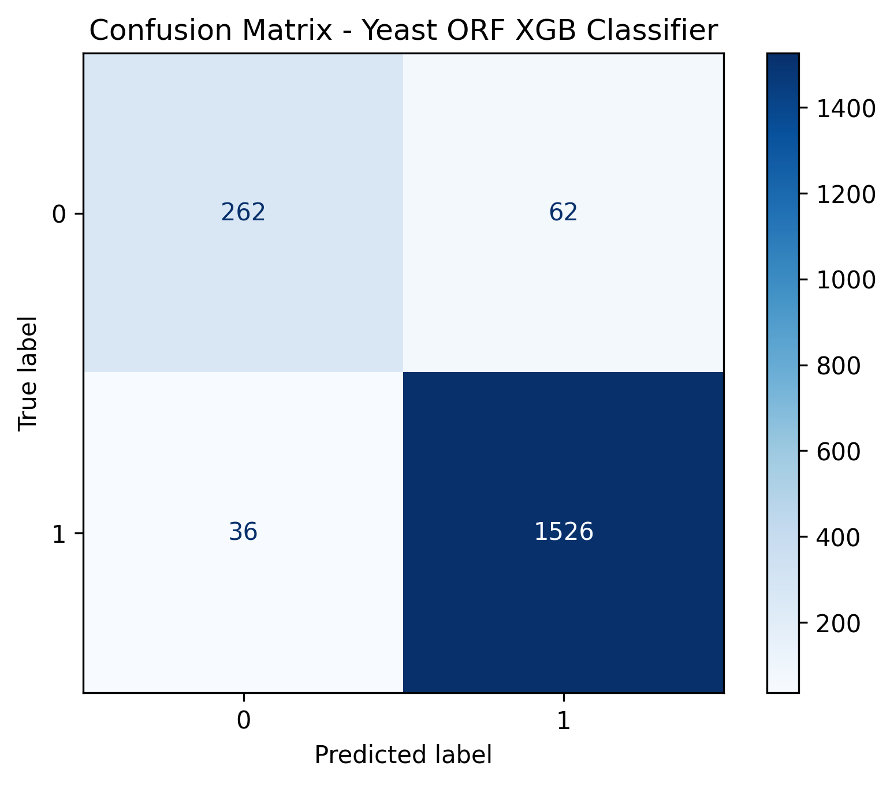

# Yeast ORF Classifier with XGBoost & Optuna

A bioinformatics machine learning pipeline to predict Open Reading Frames (ORFs) in the *Saccharomyces cerevisiae* genome using engineered sequence features and a GPU-accelerated XGBoost model, optimized via Bayesian tuning with Optuna.

---

## Overview

This project focuses on distinguishing coding from non-coding ORFs in the yeast genome using interpretable machine learning. By combining biologically inspired features with XGBoost and Optuna, we aim to identify patterns that correlate with protein-coding potential.

---

## Dataset

- **Sources**:
- Saccharomyces cerevisiae genome, *SacCer3.fasta*: [NCBI Genome - GCF_000146045.2](https://www.ncbi.nlm.nih.gov/datasets/genome/GCF_000146045.2/)
- Annotated Saccharomyces cerevisiae genome, *saccharomyces_cerevisiae.gff3*: [Ensembl.org | EMBL-EBI](https://ftp.ensembl.org/pub/release-114/gff3/saccharomyces_cerevisiae/).
- **Inputs**: ORFs predicted from the reference *S. cerevisiae* genome.
- **Features** (examples):
  - `length_x`, `length_y`: Dimensions or coordinates of the ORF
  - `stop_percent`: Proportion of stop codons
  - `gc_content`: GC base content
  - `codon_usage`: Relative codon frequencies
- **Target**:
  - Binary label: `1` = known gene, `0` = putative/non-coding

---
## Data Flow
The running order of the pipeline is:
1. ```main.py```
- Load *SacCer3.fasta* yeast genome and predict ORFs to ```predicted_orfs.fasta``` file.
- Add basic sequence features (GC content, strand, frame, sequence) and save it as ```orf_features_basic.csv```.
- Add codon usage frequencies and stop codon %, saved as ```orf_features_with_codon_usage.csv```.
- Add normalized 3-mer frequency features ```orf_features_with_kmers.csv```.
- Plot a histogram of ORF lengths.

2. ```labels_orfs.py```
- Load *saccharomyces_cerevisiae.gff3* annotation database.
- Read predicted ORFs and label them as ```known_gene``` and ```novel_orf``` based on overlap with annotated CDS features.

3. ```orf_classifier.py```
- Performs hyperparameter tuning using Bayesian optimization (Optuna).
- Trains an XGBoost classifier using the best parameters.
- Evaluates the model with 5-fold cross-validation, ROC curve plotting and AUC score calculation.

## Pipeline Steps

1. **Preprocessing**
   - Feature extraction & optional scaling.
   - Label encoding and merging feature + label sets.

2. **Train/Test Split**
   - Stratified 75/25 split to maintain class balance.

3. **Hyperparameter Tuning**
   - Bayesian optimization via [Optuna](https://optuna.org/)
   - 5-fold cross-validation using ROC AUC as the metric.

4. **Model Training**
   - XGBoost classifier with `device='cuda'` for GPU acceleration.
   - Early stopping based on validation performance.

5. **Evaluation**
   - Confusion Matrix.
   - Precision / Recall / F1-score.
   - ROC AUC.

6. **Interpretability**
   - Feature importance plots.
   - Partial Dependence Plots (PDP).

---

## Results

**Best ROC AUC (Optuna):** ~0.98  
**Test Set Metrics:**

| Metric     | Score |
|------------|-------|
| Precision  | 0.96  |
| Recall     | 0.98  |
| F1-score   | 0.97  |
| ROC AUC    | 0.98 |



**Top Features:**
- `length_y`
- `stop_percent`
- `length_x`

---

## Interpretability Insights

Partial Dependence Plots (PDP) revealed:

- `length_y` and `length_x` positively correlate with coding potential up to a plateau.
- `stop_percent` shows a strong negative impact when > 0.005.

These patterns reflect biological intuition and validate the model's interpretability.

## Project Structure
```
yeast_orf_classifier/
├── data/       # Raw input data
│   ├── saccharomyces_cerevisiae.gff3
│   └── sacCer3.fasta
├── code/        # Modular source code
│   ├── constants.py
│   ├── labels_orfs.py
│   ├── main.py
│   ├── orfs.py
│   └── orf_classifier.py
├── outputs/    # Trained models, plots, reports
│   ├── confusion_matrix.png
│   ├── feature_importance.png
│   ├── pdp_plot.png
│   ├── orf_features_basic.csv
│   ├── orf_features_with_codon_usage.csv
│   ├── orf_features_with_kmers.csv
│   ├── labels_orf.csv
│   ├── predicted_orfs.csv
│   └── predicted_orfs.fasta
├── main.py     # Main execution script
├── README.md   # Project documentation
└── requirements.txt   # Python dependencies
```
---
